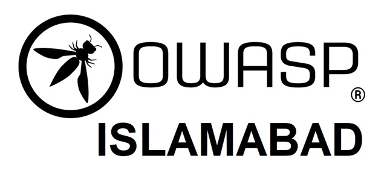

## Welcome

OWASP (The Open Web Application Security Project) is a worldwide not-for-profit organisation focused on improving the security of software. With over 200 local Chapters worldwide and 45,000+ volunteers OWASP's open community is dedicated to enabling organisations and individuals to develop and maintain applications that can be trusted. OWASP's meet-ups, tools, standards, guidelines, documents and forums are free and open to anyone interested in improving application security.

OWASP Islamabad Chapter is established in the capital city of Pakistan and focuses on spreading awareness about secure coding standards. 

If you are dealing with developing, assessing, challenging the code to address the security-related challenges pertaining to applications/web applications, or willing to invest your time in learning pertaining to secure coding best practices or wish to share your knowledge with others.. we welcome you to join us.

## Chapter News

Visit this page back for an update or our social media pages to be updated on our schedule.

### Meetings/Sessions

| Title | Meetup URL | Date |
| --- | --- | --- |
| Demystifying Web Application Security with Attack Surface Visibility | <https://www.linkedin.com/events/demystifyingwebapplicationsecur6826138865904975872/> | 9th August, 2021 (2:00 PM PST) |

